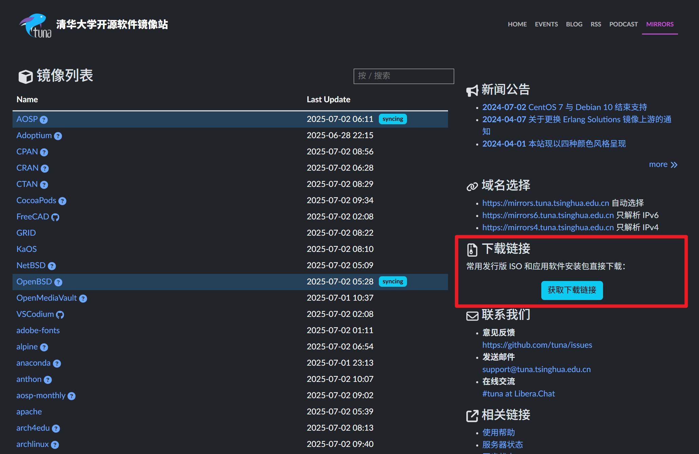
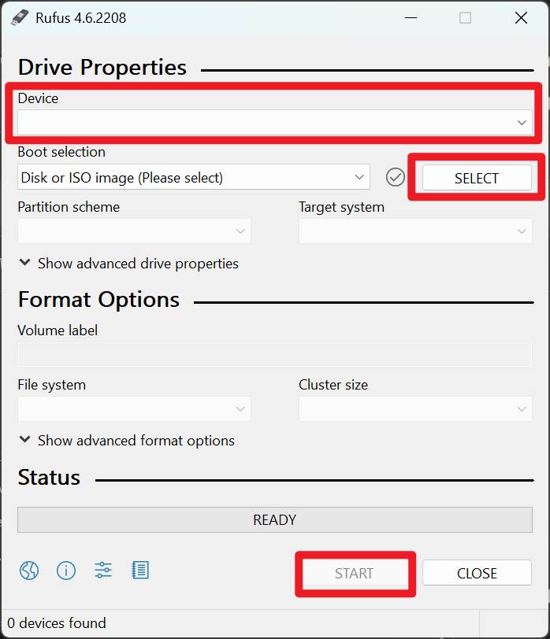

# Set up Linux

## Choose your favorite distro
作为开源系统，Linux有诸多发行版本。选择你喜欢的版本或最受欢迎的版本（如Ubuntu, Debian，更容易解决遇到的问题）即可。

### 选择桌面环境
桌面环境即是你将直接看到的图形界面。无论选择何种发行版本，KDE和Gnome都是最受欢迎的选项。比较它们不同的风格做出选择。

## Start installation
### 制作安装介质
在官方网站或镜像站（清华源：https://mirrors.tuna.tsinghua.edu.cn）下载iso映像文件


iso文件分为在线安装版和离线安装版。
- 在线安装版体积较小，安装时选项较多，但要求安装时联网。而且由于你需要在进入系统前联网，你不能进行复杂的设置，很可能需要有线网络连接。

准备一个至少8GB的U盘，下载刻录工具（免费免安装的rufus： https://rufus.ie/en/）


依次选择U盘和刚下载的iso文件，点击开始，稍等片刻，当进度条显示ready时制作完成，弹出U盘。


## Install neccessary software

### 中文输入法
卸载系统自带的输入法
```bash
sudo apt purge fcitx*
sudo apt purge ibus*
```

安装fcitx5拼音输入法

```bash
sudo apt install fcitx5 fcitx5-pinyin fcitx5-config-qt
```

设置为默认
```bash
im-config -n fcitx5
```

使更改生效
```bash
source ~/.profile
```

重新启动后才可以成功打出汉字

### winscp
使用你的windows电脑查看/linux上的文件，或将新的文件复制进来。
接下来需要进入到Ubuntu中，查看一下是否开启OpenSSH服务

```bash
sudo systemctl status ssh
```

如果未安装ssh，需要安装ssh服务

```bash
sudo apt install openssh-server
```

安装后，启动ssh服务

```bash
sudo systemctl start ssh
```
然后再检查一下ssh服务状态，显示active就说明已经安装成功

此时从windows端WinSCP新建连接，选择SMTP协议，输入linux设备的ip和用户名密码即可进入linux文件系统。